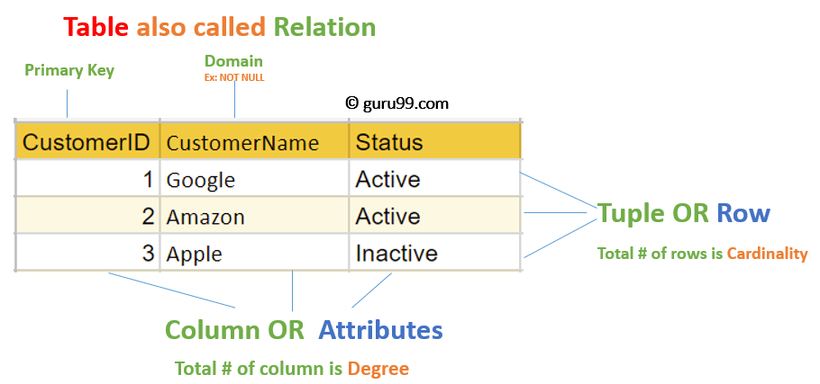

# DB Exam notes
## Overview
- [CAP theorem](#cap)
- [ACID](#acid)
- [SQL](#sql)
- [No-SQL](#no-sql)
- [Scaling](#scaling)
- [Sharding](#sharding)
- [Clustering](#clustering)
- [Load balancer](#load-balancer)

## [CAP theorem](https://www.youtube.com/watch?v=K12oQCzjPxE)
>[The CAP theorem (also called Brewer’s theorem) states that a distributed database system can only guarantee two out of these three characteristics: Consistency, Availability, and Partition Tolerance.](https://www.educative.io/edpresso/what-is-the-cap-theorem?aid=5082902844932096&utm_source=google&utm_medium=cpc&utm_campaign=edpresso-dynamic&gclid=CjwKCAjwt-L2BRA_EiwAacX32U1o9IADYBvniu-c5OThygO2jCX9aHkP-yRsctQRV_eftlWPunhRfRoCrVkQAvD_BwE)

An important note to make is that CAP should be treated as a spectrum and not an extreme. Furthermore the model is used to describe distributed database system, hence a database like Redis those not fit the model.

### Consistency
Every node provides the most recent state or does not provide a state at all.

### Availability
Every node has constant read and write access.

### Partition tolerance
The system works despite partitions in the network.
A partition is the inability for two or more nodes to communicate with eachother. In other words, the partition tolerance describes whether or not a system can deliver a node given there's a partition between two or more nodes.

### CA (Consistency/Availability)
<ul>
    <li>PostgresQL</li>
    <li></li>
    <li></li>
</ul>

### CP (Consistency/Partitioning)
<ul>
    <li>MongoDB</li>
    <li>HBase</li>
    <li></li>
</ul>

### AP (Availability/Partitioning)
<ul>
    <li></li>
    <li></li>
    <li></li>
</ul>

## ACID
[ACID](https://www.youtube.com/watch?v=5Pia4UFuMKo) is four important principles that apply to databases, and acid transactions are often very important in system, hence it yields an "all or nothing" approach. A good example is money transfering. Given 1000 units is transfered from account A to account B, account As balance has to decrease by 1000, whilst account Bs balance should increase by 1000. Given insuficient funds on account A, account Bs balance should not increase, nor should account As balance not increase. Likewise if there's a network outage. In other words, either it transaction happens, or it doesn't.

### Atomicity
Transactions are all or nothing.

### Consistency
Only valid data is saved.

### Isolation
Transactions do not affect each other.

### Durability
Written data will not be lost.

## SQL

### Relational Data Model in DBMS
>[RELATIONAL MODEL (RM) represents the database as a collection of relations. A relation is nothing but a table of values. Every row in the table represents a collection of related data values. These rows in the table denote a real-world entity or relationship.   The table name and column names are helpful to interpret the meaning of values in each row. The data are represented as a set of relations. In the relational model, data are stored as tables. However, the physical storage of the data is independent of the way the data are logically organized.](https://www.guru99.com/relational-data-model-dbms.html)

<ol>
    <li><b>Attribute:</b> Each column in a Table. Attributes are the properties which define a relation. e.g., Student_Rollno, NAME, etc.</li>
    <li><b>Tables:</b> In the relational model the, relations are saved in the table format. It is stored along with its entities. A table has two properties, rows and columns. Rows represent records and columns represent attributes.</li>
    <li><b>Tuple:</b> A single row of a table that contains a single record</li>
    <li><b>Relation Schema:</b> A relation schema represents the name of the relation with its attributes.</li>
    <li><b>Degree:</b> The total number of attributes which in the relation is called the degree of the relation.</li>
    <li><b>Cardinality:</b> The total number of rows present in the table.</li>
    <li><b>Column:</b> The column represents the sets of values for a specific attribute.</li>
    <li><b>Relation instance:</b> Relation instace is a finite set of tuples in the RDBMS system. Relation instances never have duplicate tuples.</li>
    <li><b>Relation key:</b> Every row has one, two or multiple attributes, which is called relation key.</li>
    <li><b>Attribute domain:</b> Every attribute has some pre-defined value and scope which is known as attribute domain.</li>
</ol>

### PostgreSQL

## No-SQL

### MongoDB
MongoDB is a document database, that stores the data in JSON like documents. It's widely concidered one of the all around best no-sql databases available on the market.

### Redis
Redis is an in-memory database, which in turn makes it ridicously fast, but also limits scaling options. Redis is very powerful in specific scenarios, espcially when it comes to storing and serveing tempoary data.

### Neo4j
Neo4j is a Graph database that much like the other no-sql databases is very fast, espcially when it comes to fetching a single entry. The graph structure comes with meaningful relation describtions which makes it a very strong analytic tool as well. Often revealing patterns or relations that otherwise wasn't obvious to the human eye.

### HBase

## [Scaling](https://www.youtube.com/watch?v=NdZ3y6jK_Sc)
Scaling a database might be needed if the demands or the request going to towards the database excedes the amount it can handle. Hence a need to scale the database in one form another becomes relevant

### Horizontal
Horizontal scaling is about increasing the amount of servers. In other words, many of the same component could be used to satisfy an increased demand on the servers. This would also enable the possibility of a load ballancer, to increase performance even further.

### Vertical
Vertical scaling is about increasig a single server capacity, this can be done by upgrading components, for example the ram or capacity of the server. The server itself could also be replaced with a stronger/better model.

## Sharding
[Sharding](https://www.youtube.com/watch?v=4upppuW7lGE) is an approach to horizontal scalability. Shards is about distributing data across several databases. An example could be a massive order system, where all the orders are split into chunks which are stored on different shards. In other words, a collection can be sharded. This however introduces a shard-key, so the shard manager knows where to put a specific document.

## Clustering
[Clustering](https://www.youtube.com/watch?v=NnA1WgPSbgY) means to group two or more servers/pcs having them sync their data, meaning they all store the same data.
This leads to data redundancy, but a "good kind" of redudancy, seeing as the data is synced, which means it doesn't come with the usual drawbacks of data redundacy which typically includes duplicates in the same DB, that leads to confusion, which leads to inconsistencies in the data. This so called good rendundacy allows for <b>load balancing</b>. Given the databases are at differnt physical locations, it might be benificial for someone in europe to access a server physcially located in europe, in order to get a faster response, just like it might be benificial for someone in the US, to access a server located in the US. Furthermore clustering adds an extra layer of security for your data. If one of the server in the cluster dies, all the data is still available and still stored. Allowing time to restore that faulty server, without customers actually knowing or expericing the lack of a server.

## Load balancer
[Load balancing](https://www.youtube.com/watch?v=W7ZVUdwn0Ic) is essentially redirecting trafic to the most optimal server.
